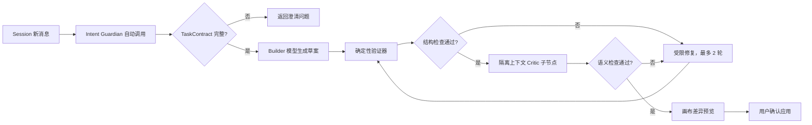

# AI 辅助构建工作流：技术选型与实现方案

> 状态：首期已于 2026-08-02 接入 Demo，包括系统 Skill、浏览器本地 Session、Builder、隔离 Critic、两轮 Repair、确定性校验、上下文压缩和用户确认应用。

## 目标与边界

用户从“模型服务”中自行选择一个已配置的供应商连接和文本模型，用自然语言描述目标。系统生成可预览的工作流草案，经过确定性结构校验、模型语义审查和受限修复后，必须由用户确认才能写入画布。

首期不允许模型直接执行工作流、不允许自动发布，也不允许未经确认生成可联网的 HTTP 节点或任意代码节点。

## 系统级 Skill

服务器内置 `system-skills/guard-workflow-intent`，只由 AI 工作流助手自动调用，不出现在普通大模型节点的用户 Skill 列表。Skill 在新建、调整、修复、解释和恢复会话时始终生效，先维护一份结构化 `TaskContract`：

- 任务目标与操作类型；
- 范围内、范围外和明确禁止事项；
- 必需输入、预期输出及数量；
- HTTP/代码权限、模型调用预算、成本与时延限制；
- 验收标准、显式假设和未决问题。

若目标、输入、输出、边界或验收标准仍存在阻塞性缺口，只能返回最多 3 个澄清问题，不能生成或修改画布。Skill 不能自我批准结果，也不能声称已经应用、运行或发布工作流。

## 推荐技术选型

| 层 | 选择 | 原因 |
|---|---|---|
| 模型协议 | OpenAI 兼容 `/chat/completions` 与 `/responses` | 可复用用户选择的供应商连接、Key、协议与模型 |
| 结构输出 | JSON Schema Structured Output；不支持时退化为严格 JSON + 提取器 | 避免模型输出说明文字污染图数据 |
| Schema 校验 | 服务端确定性契约校验；后续可替换为 Ajv 编译 Schema | 当前无新增运行依赖，同时给出字段级问题代码 |
| 图校验 | `workflow-assistant-core.mjs` 的独立校验器 | 检查开始/结束、可达性、悬空边、环路、条件出口、供应商、权限、预算与 Secret |
| 编排位置 | 服务端新增 `/api/workflow-assistant/turn` | 集中实现 Session turn、超时、重试、审查、日志和供应商错误归一化；Key 只在请求期使用 |
| 修复协议 | 首期返回完整修订草案并重新完整校验；后续升级为受限 RFC 6902 JSON Patch | 先保证可验证与不可越权，再缩小模型可修改范围 |
| 前端交互 | 固定右侧 AI 构建面板 + 草案摘要 | 用户检查节点/连线数量、校验问题后确认应用 |
| 可观测性 | requestId + Session id + 每阶段事件 | 能区分意图、生成、静态校验、语义审查和修复失败 |

模型必须支持稳定的结构化输出；优先让用户从已声明的文本模型中选择。高风险场景可额外选择另一个供应商/模型作为审查模型，避免生成与审查完全同源。

## 工作流生成管线



### 1. 需求规范化

把用户输入转换为内部 `WorkflowIntent`：目标、输入、期望输出、允许节点类型、指定供应商、成本/时延限制和是否允许 HTTP/代码节点。缺少关键参数时只返回澄清问题，不生成画布。

### 2. Builder 生成

输入仅包含节点目录、字段约束、可选的 `providerId/modelId`、模板摘要和用户需求。输出必须符合新的 `aiflow.workflow-draft` Schema，节点 ID 使用稳定前缀，不能携带 API Key 或其他凭证。

### 3. 确定性自检

这是强制门槛，优先级高于模型自评：

- JSON Schema、字段类型、长度和枚举校验。
- 节点/边 ID 唯一，边端点存在，无环路。
- 恰好一个开始节点，至少一个可达结束节点。
- 条件节点只能使用 `true/false` 出口。
- 模型节点引用存在的供应商和该连接声明的模型。
- 输出绑定引用可达上游，业务 Key 不重复。
- HTTP URL、Headers 和代码节点执行权限检查。
- 估算最大并发、模型调用次数和潜在成本。

### 4. 语义 Critic

Critic 不重新生成工作流，只按检查清单输出 `issues[]`：严重度、节点 ID、证据、修复建议。检查需求覆盖率、数据流是否完整、提示词输入是否可得、分支是否有遗漏、输出是否与用户目标一致。

“让同一个模型说自己没问题”不属于严格自检。至少要做到不同系统提示词和独立上下文；生产环境建议允许用户选择第二模型作为 Critic。

Critic 作为内部子节点存在，不进入用户工作流画布。它只接收 TaskContract、候选草案、当前工作流、确定性校验事实及可用目录，不接收 Builder 对话或自评。它不得修改草案，只能返回带 `severity/code/nodeId/evidence/suggestedFix` 的问题列表。

### 5. 受限修复

首期 Repair 模型返回完整修订草案，但服务端不会信任其自评：每一轮都从结构、图、供应商、权限、预算与 Secret 检查重新开始。最多两轮，仍未通过则保存草案和诊断，不自动应用。后续切换到 RFC 6902 JSON Patch 时，需额外拒绝修改凭证、供应商连接、Schema 版本和安全策略字段。

### 6. 用户确认

前端显示新增、修改、删除的节点与连线、所选供应商/模型、预计调用数和所有警告。用户可“应用草案”“返回修改需求”或“放弃”。只有确认后才进入撤销栈并写入本地工作流。

## Session 与上下文压缩

每次 AI 构建或调整过程对应一个 `WorkflowAssistantSession`，状态依次在 `discovery / drafting / validating / repairing / awaiting_confirmation / applied / blocked` 之间转换。当前本地优先方案把 Session 保存在浏览器 `localStorage`，服务端仅处理本次快照，不持久化对话、用户 Skill 或 API Key。

Session 不只保存聊天文本，还要独立持久化 TaskContract、当前工作流 revision、候选草案、验证报告、修复次数、未决问题、结构化摘要与最近对话。这样压缩历史时不会丢失权限边界或验收标准。

压缩在以下任一条件满足时自动触发：组装后的上下文达到所选模型窗口的 70%，或原始消息超过 12 轮。保留系统 Skill、TaskContract、最新工作流、候选草案、验证问题、未决问题和最近 6 轮原文；更早内容压缩为带来源 turn ID 的结构化摘要。

压缩结果必须再次做完整性校验：不得丢失验收标准、改变授权边界、恢复已否决方案、删除未决问题，或虚构“已应用”事件。第一次压缩不合格可重试一次；再次失败则保留旧摘要并阻止继续扩张上下文。

## 错误处理

| 错误 | 行为 |
|---|---|
| 401/403 | 标记供应商凭证不可用，引导回模型服务页；不重试 |
| 408/网络超时 | 最多一次指数退避重试，保留自然语言需求 |
| 429 | 读取 `Retry-After`，允许用户切换连接或稍后重试 |
| 5xx | 最多两次有限重试，显示供应商请求 ID |
| 非法 JSON | 尝试一次严格提取；失败进入修复，不直接解析自由文本 |
| Schema/图校验失败 | 返回字段路径与节点 ID，进入最多两轮修复 |
| Critic 拒绝 | 保留草案与问题列表，不写入画布 |
| 用户停止 | 中止当前请求，保留需求和最近一次合法草案 |

## API 草案

```http
POST /api/workflow-assistant/turn
X-AIFlow-API-Key: <用户选中连接的 Key>
Content-Type: application/json
```

```json
{
  "session": {
    "id": "was_01...",
    "phase": "discovery",
    "summary": {},
    "recentTurns": [],
    "currentWorkflowRevision": "sha256:..."
  },
  "provider": {
    "baseUrl": "https://provider.example.com/v1",
    "model": "user-selected-model"
  },
  "message": "为三个渠道生成商品图片和对应文案",
  "constraints": {
    "allowHttp": false,
    "allowCode": false,
    "maxModelCalls": 8
  },
  "currentWorkflow": null,
  "criticProvider": null
}
```

响应返回更新后的 Session、TaskContract、合法草案、检查报告、修复次数、上下文压缩事件、警告与差异摘要，不返回 API Key。MVP 可让 Critic 使用同一模型但必须是独立调用和独立系统上下文；高风险任务允许指定第二供应商与模型。

## 已实现范围

- `system-skills/guard-workflow-intent` 在服务启动时加载，完整指令不进入公开 Skill 目录。
- `POST /api/workflow-assistant/turn` 支持 Chat Completions 与 Responses，并可使用第二供应商作为 Critic。
- Builder、Critic 与上下文压缩分别使用隔离调用；Critic 不接收 Builder 的自评文本。
- Session 使用 `aiflow.demo.workflow-assistant-session` 保存在浏览器，Key 不写入 Session 或请求正文。
- 上下文超过 12 轮或窗口 70% 时压缩较早历史，最近 6 轮保持原文；摘要失败会阻断继续扩张。
- 前端只有在 `validation.valid === true` 且用户点击“确认应用”后才写入画布，并先进入撤销栈。

## 后续实施顺序

1. 将当前手写契约校验固化为可版本化 JSON Schema，并以 Ajv 编译执行。
2. 把完整草案 Repair 收紧为受限 RFC 6902 JSON Patch。
3. 增加逐节点/逐连线差异预览和单项接受能力。
4. 将 Session 审计事件接入可选的服务端持久化，同时继续禁止存储明文 Key。
5. 增加真实模型固定语料回归集、token/成本估算与供应商级限流。
6. 最后开放受控 HTTP/代码节点生成，并增加显式二次确认。

## 验收门槛

- 100 组固定需求的 Schema 合法率达到 100%。
- 不允许环路、悬空边、无结束节点或不存在的供应商引用进入画布。
- 修复失败时不覆盖用户当前工作流。
- 任何响应、日志、草案和导出文件都不包含 API Key。
- 同一输入可回放，完整记录模型、供应商、提示模板版本、检查结果和 correlationId。
- 任意 Session 恢复或压缩后，TaskContract、授权边界、验收标准、未决问题和当前 revision 必须保持一致。
- Builder 无法绕过确定性验证器或伪造 Critic 通过状态；只有服务端编排器能写入验证结果。
