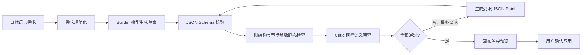

# AI 辅助构建工作流：技术选型与实现方案

> 状态：仅设计，当前版本不实现。

## 目标与边界

用户从“模型服务”中自行选择一个已配置的供应商连接和文本模型，用自然语言描述目标。系统生成可预览的工作流草案，经过确定性结构校验、模型语义审查和受限修复后，必须由用户确认才能写入画布。

首期不允许模型直接执行工作流、不允许自动发布，也不允许未经确认生成可联网的 HTTP 节点或任意代码节点。

## 推荐技术选型

| 层 | 选择 | 原因 |
|---|---|---|
| 模型协议 | 现有 OpenAI 兼容 `/chat/completions` | 可复用用户选择的供应商连接、Key 与模型 |
| 结构输出 | JSON Schema Structured Output；不支持时退化为严格 JSON + 提取器 | 避免模型输出说明文字污染图数据 |
| Schema 校验 | JSON Schema + Ajv | 给出字段级错误路径，适合修复循环 |
| 图校验 | 复用并扩展 `validateWorkflowGraph` | 检查唯一开始节点、可达结束节点、悬空边、环路和条件出口 |
| 编排位置 | 服务端新增 `/api/workflows/generate` | 集中实现超时、重试、审查、日志和供应商错误归一化；Key 只在请求期使用 |
| 修复协议 | 受限 RFC 6902 JSON Patch | 只允许修改草案白名单路径，每次补丁后重新完整校验 |
| 前端交互 | 右侧 AI 构建面板 + 画布差异预览 | 用户可检查新增/修改/删除节点后再应用 |
| 可观测性 | correlationId + generationId + 每阶段事件 | 能区分生成、静态校验、语义审查和修复失败 |

模型必须支持稳定的结构化输出；优先让用户从已声明的文本模型中选择。高风险场景可额外选择另一个供应商/模型作为审查模型，避免生成与审查完全同源。

## 工作流生成管线



### 1. 需求规范化

把用户输入转换为内部 `WorkflowIntent`：目标、输入、期望输出、允许节点类型、指定供应商、成本/时延限制和是否允许 HTTP/代码节点。缺少关键参数时只返回澄清问题，不生成画布。

### 2. Builder 生成

输入仅包含节点目录、字段约束、可选的 `providerId/modelId`、模板摘要和用户需求。输出必须符合新的 `aiflow.workflow-draft` Schema，节点 ID 使用稳定前缀，不能携带 API Key 或其他凭证。

### 3. 确定性自检

这是强制门槛，优先级高于模型自评：

- JSON Schema、字段类型、长度和枚举校验。
- 节点/边 ID 唯一，边端点存在，无环路。
- 恰好一个开始节点，至少一个可达结束节点。
- 条件节点只能使用 `true/false` 出口。
- 模型节点引用存在的供应商和该连接声明的模型。
- 输出绑定引用可达上游，业务 Key 不重复。
- HTTP URL、Headers 和代码节点执行权限检查。
- 估算最大并发、模型调用次数和潜在成本。

### 4. 语义 Critic

Critic 不重新生成工作流，只按检查清单输出 `issues[]`：严重度、节点 ID、证据、修复建议。检查需求覆盖率、数据流是否完整、提示词输入是否可得、分支是否有遗漏、输出是否与用户目标一致。

“让同一个模型说自己没问题”不属于严格自检。至少要做到不同系统提示词和独立上下文；生产环境建议允许用户选择第二模型作为 Critic。

### 5. 受限修复

最多两轮。Repair 模型只输出 JSON Patch；服务端拒绝修改凭证、供应商连接、Schema 版本和安全策略字段。每轮补丁应用后从 JSON Schema 开始重新执行全部检查。仍未通过则保存草案和诊断，不自动应用。

### 6. 用户确认

前端显示新增、修改、删除的节点与连线、所选供应商/模型、预计调用数和所有警告。用户可“应用草案”“返回修改需求”或“放弃”。只有确认后才进入撤销栈并写入本地工作流。

## 错误处理

| 错误 | 行为 |
|---|---|
| 401/403 | 标记供应商凭证不可用，引导回模型服务页；不重试 |
| 408/网络超时 | 最多一次指数退避重试，保留自然语言需求 |
| 429 | 读取 `Retry-After`，允许用户切换连接或稍后重试 |
| 5xx | 最多两次有限重试，显示供应商请求 ID |
| 非法 JSON | 尝试一次严格提取；失败进入修复，不直接解析自由文本 |
| Schema/图校验失败 | 返回字段路径与节点 ID，进入最多两轮修复 |
| Critic 拒绝 | 保留草案与问题列表，不写入画布 |
| 用户停止 | 中止当前请求，保留需求和最近一次合法草案 |

## API 草案

```http
POST /api/workflows/generate
X-AIFlow-API-Key: <用户选中连接的 Key>
Content-Type: application/json
```

```json
{
  "provider": {
    "baseUrl": "https://provider.example.com/v1",
    "model": "user-selected-model"
  },
  "intent": "为三个渠道生成商品图片和对应文案",
  "constraints": {
    "allowHttp": false,
    "allowCode": false,
    "maxModelCalls": 8
  },
  "currentWorkflow": null
}
```

响应返回 `generationId`、合法草案、检查报告、修复次数、警告与差异摘要，不返回 API Key。

## 建议实施顺序

1. 定义 `workflow-draft.schema.json` 和确定性验证报告结构。
2. 提取当前图校验为服务端/前端共享模块，并补充供应商引用、输出绑定和成本检查。
3. 实现单次 Builder 生成与只读差异预览。
4. 加入 Critic 和最多两轮受限 Repair。
5. 加入终止、超时、重试、运行事件和审计记录。
6. 最后开放受控 HTTP/代码节点生成，并增加显式二次确认。

## 验收门槛

- 100 组固定需求的 Schema 合法率达到 100%。
- 不允许环路、悬空边、无结束节点或不存在的供应商引用进入画布。
- 修复失败时不覆盖用户当前工作流。
- 任何响应、日志、草案和导出文件都不包含 API Key。
- 同一输入可回放，完整记录模型、供应商、提示模板版本、检查结果和 correlationId。
