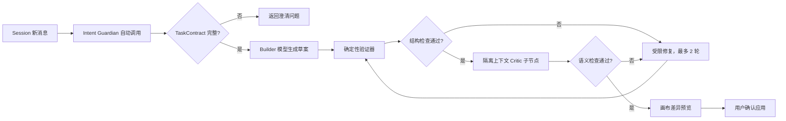

# AI 辅助构建工作流：技术选型与实现方案

> 状态：已于 2026-08-03 接入 Demo，包括系统 Skill、浏览器本地 Session、Builder、唯一 WorkflowPlan、Plan 编译器、流程图与说明预览、隔离 Critic、两轮 Repair、确定性校验、上下文压缩和用户确认应用。

## 目标与边界

用户从“模型服务”中自行选择一个已配置的供应商连接和文本模型，用自然语言描述目标。系统生成可预览的工作流草案，经过确定性结构校验、模型语义审查和受限修复后，必须由用户确认才能写入画布。

首期不允许模型直接执行工作流、不允许自动发布，也不允许未经确认生成可联网的 HTTP 节点或任意代码节点。

## 系统级 Skill

服务器内置 `system-skills/guard-workflow-intent`，只由 AI 工作流助手自动调用，不出现在普通大模型节点的用户 Skill 列表。Skill 在新建、调整、修复、解释和恢复会话时始终生效，先维护一份结构化 `TaskContract`：

- 任务目标与操作类型；
- 范围内、范围外和明确禁止事项；
- 必需输入、预期输出及数量；
- HTTP/代码权限、模型调用预算、成本与时延限制；
- 验收标准、显式假设和未决问题。

若目标、输入、输出、边界或验收标准仍存在阻塞性缺口，只能返回最多 3 个澄清问题，不能生成或修改画布。Skill 不能自我批准结果，也不能声称已经应用、运行或发布工作流。

## 推荐技术选型

| 层 | 选择 | 原因 |
|---|---|---|
| 模型协议 | OpenAI 兼容 `/chat/completions` 与 `/responses` | 可复用用户选择的供应商连接、Key、协议与模型 |
| 结构输出 | JSON Schema Structured Output；不支持时退化为严格 JSON + 提取器 | 避免模型输出说明文字污染图数据 |
| Schema 校验 | 服务端确定性契约校验；后续可替换为 Ajv 编译 Schema | 当前无新增运行依赖，同时给出字段级问题代码 |
| 图校验 | `workflow-assistant-core.mjs` 的 Plan 编译器与独立校验器 | 检查 Plan/画布一致性、重复与跨级冗余连接、多主输入、开始/结束、双向可达性、环路、条件出口、供应商、权限、预算与 Secret |
| 编排位置 | 服务端新增 `/api/workflow-assistant/turn` | 集中实现 Session turn、超时、重试、审查、日志和供应商错误归一化；Key 只在请求期使用 |
| 修复协议 | 首期返回完整修订草案并重新完整校验；后续升级为受限 RFC 6902 JSON Patch | 先保证可验证与不可越权，再缩小模型可修改范围 |
| 前端交互 | 固定右侧 AI 构建面板 + Plan 流程图 + 逐节点/数据流说明 | 用户在画布变更前检查完整流程并确认应用 |
| 可观测性 | requestId + Session id + 每阶段事件 | 能区分意图、生成、静态校验、语义审查和修复失败 |

模型必须支持稳定的结构化输出；优先让用户从已声明的文本模型中选择。高风险场景可额外选择另一个供应商/模型作为审查模型，避免生成与审查完全同源。

## 工作流生成管线



### 1. 需求规范化

把用户输入转换为内部 `WorkflowIntent`：目标、输入、期望输出、允许节点类型、指定供应商、成本/时延限制和是否允许 HTTP/代码节点。用户只确认 AI 识别出的输入与输出；其余字段按安全默认值推断并记录，不作为确认问题。输入输出签名发生变化时必须重新确认，未变化的后续调整沿用已确认状态。

### 2. Builder 生成

输入仅包含节点目录、字段约束、可选的 `providerId/modelId`、模板摘要和用户需求。输出必须符合新的 `aiflow.workflow-draft` Schema，并先定义唯一的 `aiflow.workflow-plan`。Plan 中每个步骤必须声明 ID、类型、标题、职责、输入和输出；每条连接必须声明起点、终点、数据类型与连接原因。节点配置只能使用 Plan 中的 ID，不能携带 API Key 或其他凭证。

服务端不会信任 Builder 返回的位置或边：节点坐标由确定性分层布局生成，画布 `edges` 仅由 `WorkflowPlan.connections` 编译。流程图、流程说明和最终画布因此共享同一事实来源，不存在分别生成后发生漂移的问题。

### 3. 确定性自检

这是强制门槛，优先级高于模型自评：

- JSON Schema、字段类型、长度和枚举校验。
- 节点/边 ID 唯一，边端点存在，无环路。
- Plan 步骤与画布节点一一对应，Plan 连接与画布边一一对应。
- 拒绝重复边、存在替代完整路径的跨级冗余边，以及普通处理节点的多个主上游。
- 多分支进入结束节点前必须经过聚合节点；每个节点都必须从开始可达并能到达某个结束节点。
- 恰好一个开始节点，至少一个可达结束节点。
- 条件节点只能使用 `true/false` 出口。
- 模型节点引用存在的供应商和该连接声明的模型。
- 输出绑定引用可达上游，业务 Key 不重复。
- HTTP URL、Headers 和代码节点执行权限检查。
- 估算最大并发、模型调用次数和潜在成本。

### 4. 语义 Critic

Critic 不重新生成工作流，只按检查清单输出 `issues[]`：严重度、节点 ID、证据、修复建议。检查需求覆盖率、数据流是否完整、提示词输入是否可得、分支是否有遗漏、输出是否与用户目标一致。

“让同一个模型说自己没问题”不属于严格自检。至少要做到不同系统提示词和独立上下文；生产环境建议允许用户选择第二模型作为 Critic。

Critic 作为内部子节点存在，不进入用户工作流画布。它只接收 TaskContract、候选草案、当前工作流、确定性校验事实及可用目录，不接收 Builder 对话或自评。它不得修改草案，只能返回带 `severity/code/nodeId/evidence/suggestedFix` 的问题列表。

### 5. 受限修复

首期 Repair 模型返回完整修订草案，但服务端不会信任其自评：每一轮都从结构、图、供应商、权限、预算与 Secret 检查重新开始。最多两轮，仍未通过则保存草案和诊断，不自动应用。后续切换到 RFC 6902 JSON Patch 时，需额外拒绝修改凭证、供应商连接、Schema 版本和安全策略字段。

### 6. 用户确认

前端由 WorkflowPlan 渲染完整流程图、整体摘要、逐节点职责与输入输出、逐连线的数据类型和原因，同时显示校验问题。用户可“确认并应用”或“需要调整”；只有确认后才进入撤销栈并写入本地工作流。若画布 revision 在草案生成后变化，确认按钮自动失效。用户再次发送调整需求时，上一版 Plan、通过状态与应用按钮立即锁定，只显示“正在生成新版流程方案”；本轮校验链完成后才展示最新版本。

## Session 与上下文压缩

每次 AI 构建或调整过程对应一个 `WorkflowAssistantSession`，状态依次在 `discovery / drafting / validating / repairing / awaiting_confirmation / applied / blocked` 之间转换。当前本地优先方案把 Session 保存在浏览器 `localStorage`，服务端仅处理本次快照，不持久化对话、用户 Skill 或 API Key。

Session 不只保存聊天文本，还要独立持久化 TaskContract、当前工作流 revision、候选草案、验证报告、修复次数、未决问题、结构化摘要与最近对话。这样压缩历史时不会丢失权限边界或验收标准。

压缩在以下任一条件满足时自动触发：组装后的上下文达到所选模型窗口的 70%，或原始消息超过 12 轮。保留系统 Skill、TaskContract、最新工作流、候选草案、验证问题、未决问题和最近 6 轮原文；更早内容压缩为带来源 turn ID 的结构化摘要。

压缩结果必须再次做完整性校验：不得丢失验收标准、改变授权边界、恢复已否决方案、删除未决问题，或虚构“已应用”事件。第一次压缩不合格可重试一次；再次失败则保留旧摘要并阻止继续扩张上下文。

## 错误处理

| 错误 | 行为 |
|---|---|
| 401/403 | 标记供应商凭证不可用，引导回模型服务页；不重试 |
| 408/网络超时 | 最多一次指数退避重试，保留自然语言需求 |
| 429 | 读取 `Retry-After`，允许用户切换连接或稍后重试 |
| 5xx | 最多两次有限重试，显示供应商请求 ID |
| 空响应/HTML 错误页 | 前端先读文本再解析，转换为 `ASSISTANT_EMPTY_RESPONSE` / `ASSISTANT_INVALID_RESPONSE`，显示 HTTP 状态与请求 ID，不暴露浏览器原生 JSON 异常 |
| 阶段流中断 | 返回 `ASSISTANT_STREAM_INTERRUPTED` 或 `ASSISTANT_STREAM_INCOMPLETE`，停止动画并保持当前画布不变 |
| 非法或重复 JSON | 按字符串边界提取完整对象；相同重复对象去重，冲突对象触发一次无损 JSON 格式修复，随后仍需通过完整 Schema 与图校验 |
| Schema/图校验失败 | 返回字段路径与节点 ID，进入最多两轮修复 |
| Critic 拒绝 | 保留草案与问题列表，不写入画布 |
| 用户停止 | 中止当前请求，保留需求和最近一次合法草案 |

## API 草案

```http
POST /api/workflow-assistant/turn
X-AIFlow-API-Key: <用户选中连接的 Key>
Content-Type: application/json
Accept: application/x-ndjson
```

长任务使用 NDJSON 返回 `stage / heartbeat / result` 事件。服务端在 Builder、确定性校验、Critic、格式修复与 Repair 开始/结束时发送真实阶段事件，并每 15 秒发送一次无业务含义的心跳；同时设置 `X-Accel-Buffering: no`，避免反向代理因长时间没有响应字节而截断连接。未声明 NDJSON 的旧客户端仍收到普通 JSON。

```json
{
  "session": {
    "id": "was_01...",
    "phase": "discovery",
    "summary": {},
    "recentTurns": [],
    "currentWorkflowRevision": "sha256:..."
  },
  "provider": {
    "baseUrl": "https://provider.example.com/v1",
    "model": "user-selected-model"
  },
  "message": "为三个渠道生成商品图片和对应文案",
  "constraints": {
    "allowHttp": false,
    "allowCode": false,
    "maxModelCalls": 8
  },
  "currentWorkflow": null,
  "criticProvider": null
}
```

响应返回更新后的 Session、TaskContract、合法草案、检查报告、修复次数、上下文压缩事件、警告与差异摘要，不返回 API Key。MVP 可让 Critic 使用同一模型但必须是独立调用和独立系统上下文；高风险任务允许指定第二供应商与模型。

## 已实现范围

- `system-skills/guard-workflow-intent` 在服务启动时加载，完整指令不进入公开 Skill 目录。
- `POST /api/workflow-assistant/turn` 支持 Chat Completions 与 Responses，并可使用第二供应商作为 Critic。
- Builder、Critic 与上下文压缩分别使用隔离调用；Critic 不接收 Builder 的自评文本。
- Session 使用 `aiflow.demo.workflow-assistant-session` 保存在浏览器，Key 不写入 Session 或请求正文。
- 上下文超过 12 轮或窗口 70% 时压缩较早历史，最近 6 轮保持原文；摘要失败会阻断继续扩张。
- 前端只有在 `validation.valid === true` 且用户点击“确认应用”后才写入画布，并先进入撤销栈。
- `WorkflowPlan` 是流程图、说明、节点和连线的唯一事实来源；服务端编译坐标与 edges，客户端应用前再次校验 Plan/画布完全一致。
- 确认面板展示可滚动流程图、逐节点职责/输入/输出和每条连接的原因；用户可直接要求 AI 调整方案。
- 确定性验证器阻断重复逻辑边、跨级冗余边、普通节点多主输入、未聚合多分支输出和无法到达输出的死路节点。
- 系统只让用户确认 AI 识别出的输入与输出；输入输出签名与 Session 绑定，范围、验收、权限和预算采用安全默认值。“其他”携带用户修正并触发重新识别，更新后的输入输出必须再次确认。
- 二次调整开始时隐藏上一版有效校验与应用操作，显示锁定状态；仅当最新响应进入 `awaiting_confirmation` 且本轮验证有效时恢复“确认并应用”。
- 模型网络错误或单次超时自动重试一次；连续超时返回 `ASSISTANT_MODEL_TIMEOUT` 与中文 504 提示，不回显底层 Abort 异常。
- 助手单次模型调用默认等待 300 秒，可配置为 30–900 秒；超时后服务端把 Session 置为 `blocked`，前端停止阶段动画并提供“重新尝试 / 切换模型”。
- 前端不再直接调用 `response.json()`：空响应、非 JSON、读取失败、阶段流中断和缺少最终结果均转换为带错误码、HTTP 状态和请求 ID 的中文诊断。
- AI 构建过程实时展示“解析输入输出、修复模型输出格式、绑定可用模型、校验流程结构、审查任务覆盖、自动修复方案、准备结果”，包含进行中/成功/失败状态与累计耗时。
- 模型输出按完整 JSON 对象边界解析；重复相同对象确定性去重，冲突对象最多执行一次严格格式修复，不接受未经 Schema、Plan 和图校验的自由文本。
- 无效文本模型引用确定性绑定到用户当前选择且目录中存在的 Builder 模型；图像节点只绑定真实声明的图像模型，无兼容模型时仍然阻断。
- Critic 接收不含 `edges` 的规范草案与独立只读 `compiledGraph`；应用派生连线与 Plan 一致时不得误判为模型越权。
- 2026-08-04 使用 OpenAI 兼容供应商和 `gpt-5.6-luna` 完成真实两轮验收：输入输出确认后生成 4 节点/3 连线草案，确定性校验与 Critic 均通过，0 个问题、0 次 Repair；测试密钥未写入文件、日志或镜像。

## 后续实施顺序

1. 将当前手写契约校验固化为可版本化 JSON Schema，并以 Ajv 编译执行。
2. 把完整草案 Repair 收紧为受限 RFC 6902 JSON Patch。
3. 增加调整现有工作流时的逐节点/逐连线差异视图和单项接受能力。
4. 将 Session 审计事件接入可选的服务端持久化，同时继续禁止存储明文 Key。
5. 增加真实模型固定语料回归集、token/成本估算与供应商级限流。
6. 最后开放受控 HTTP/代码节点生成，并增加显式二次确认。

## 验收门槛

- 100 组固定需求的 Schema 合法率达到 100%。
- 不允许环路、悬空边、无结束节点或不存在的供应商引用进入画布。
- 修复失败时不覆盖用户当前工作流。
- 任何响应、日志、草案和导出文件都不包含 API Key。
- 同一输入可回放，完整记录模型、供应商、提示模板版本、检查结果和 correlationId。
- 任意 Session 恢复或压缩后，TaskContract、授权边界、验收标准、未决问题和当前 revision 必须保持一致。
- Builder 无法绕过确定性验证器或伪造 Critic 通过状态；只有服务端编排器能写入验证结果。
- 自动化基线为 48 项测试全通过；浏览器回归覆盖空响应、错误码与请求 ID、阶段动画停止、输入输出确认、最新草案锁定、应用门禁和刷新恢复，非预期 console/page error 为 0。
